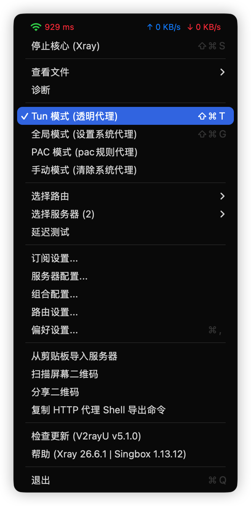
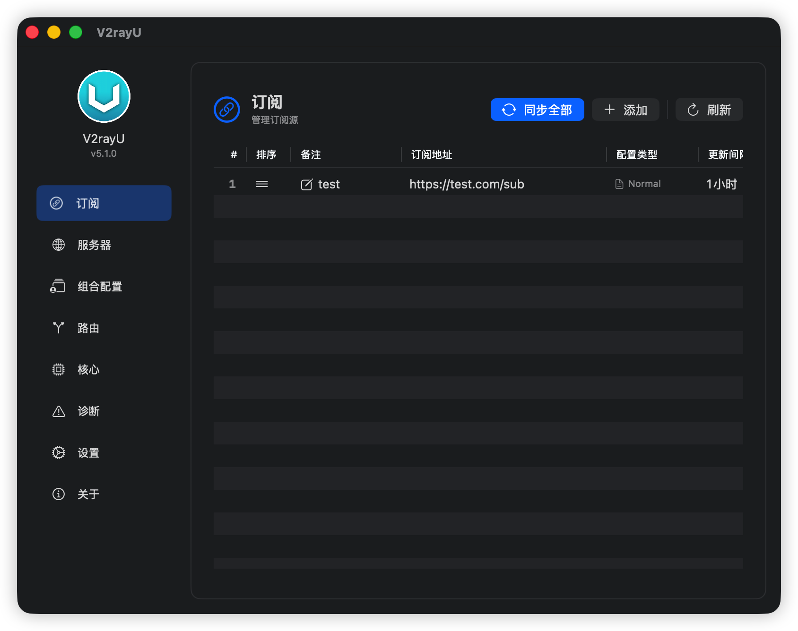
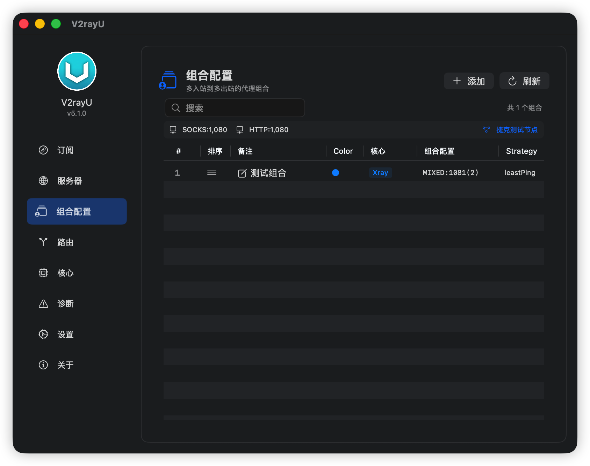
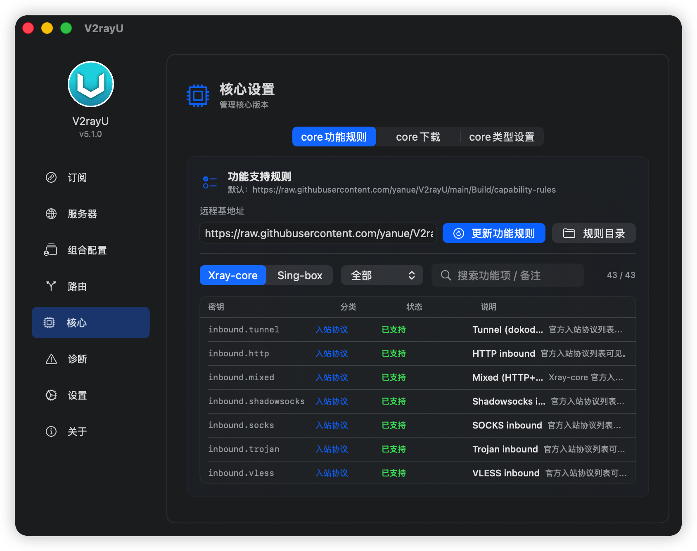
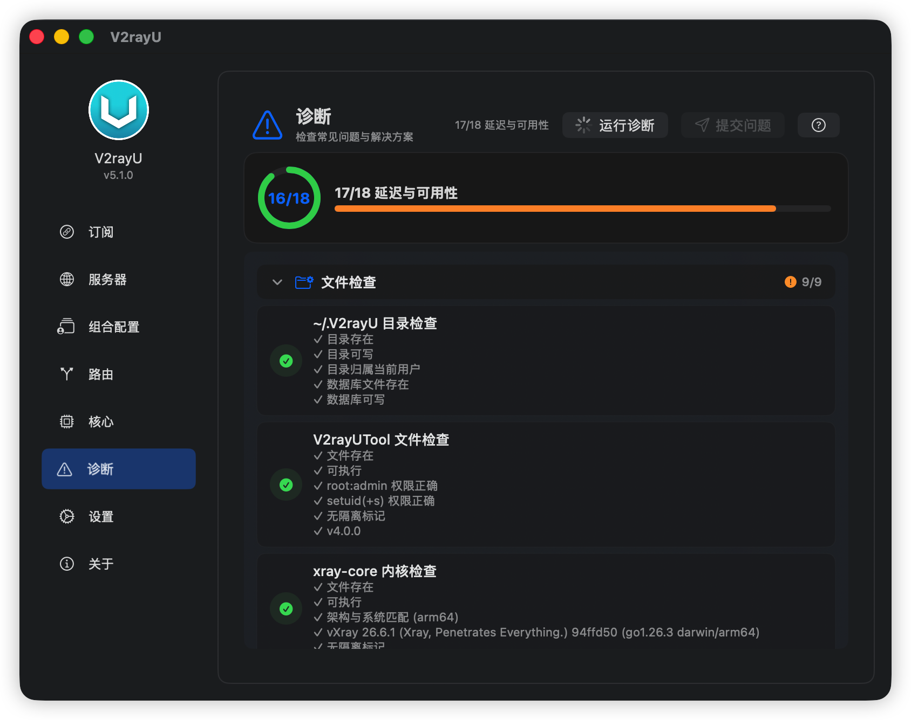
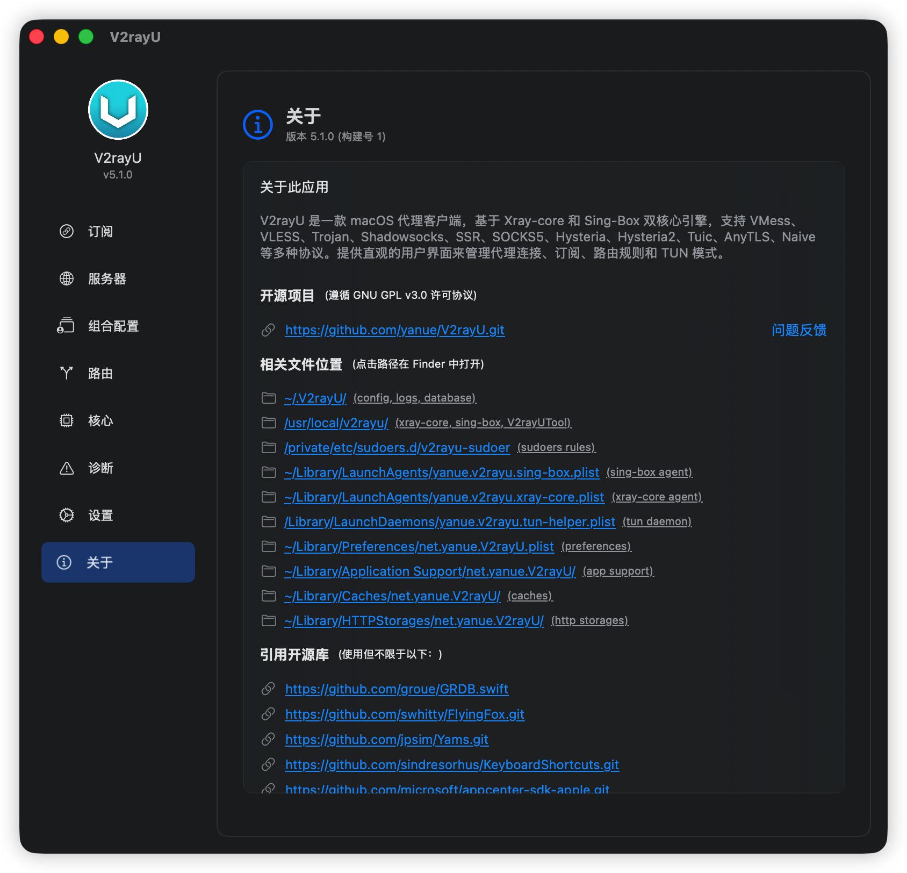
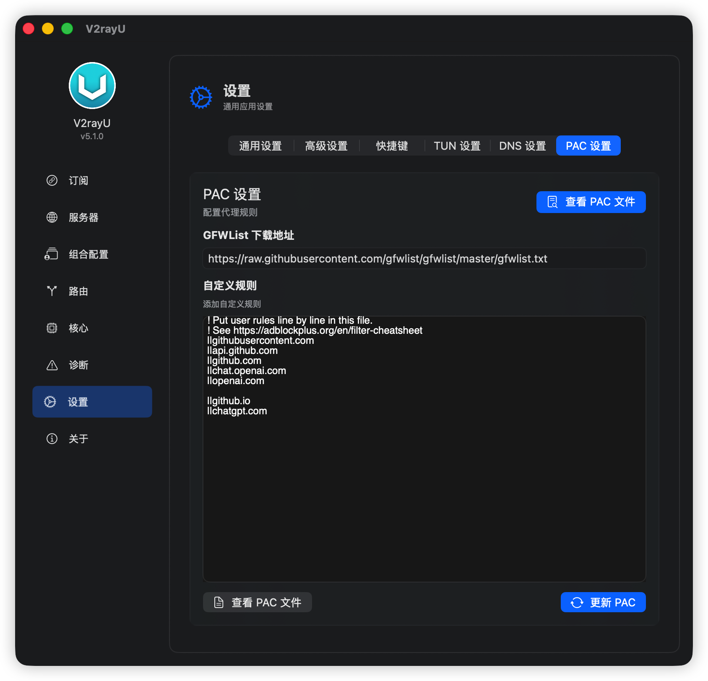
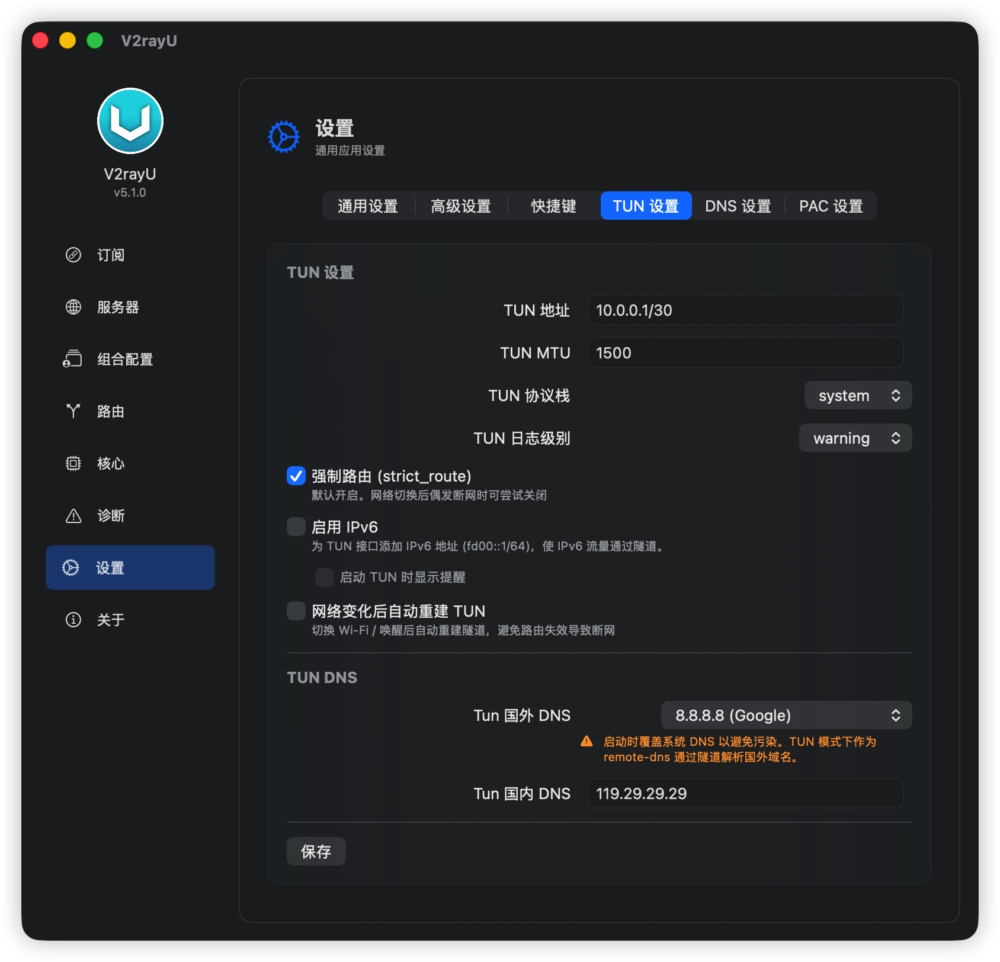

<picture><source media="(prefers-color-scheme: dark)" srcset="./V2rayU/Resources/Assets.xcassets/AppIcon.appiconset/128.png"></picture>

# V2rayU 

macOS 平台下的代理客户端，基于 [Xray-core](https://github.com/XTLS/Xray-core) 与 [sing-box](https://github.com/SagerNet/sing-box)，支持 VMess、VLESS、Trojan、Shadowsocks、SSR、SOCKS5、Hysteria、Hysteria2、Tuic、AnyTLS、Naive 等多种协议。SwiftUI 编写，支持 macOS 14+。

> 旧版(5.0以下)基于 V2Ray-core 的项目请查看 [master](https://github.com/yanue/V2rayU/tree/master) 分支。

---

## 功能特性

- **多协议支持** — VMess、VLESS、Trojan、Shadowsocks、SSR、SOCKS5、Hysteria、Hysteria2、Tuic、AnyTLS、Naive 等
- **双核心引擎** — 智能选择 Xray-core 或 sing-box，根据协议/传输/安全配置自动匹配最兼容的核心
- **运行模式** — PAC 模式、全局代理、手动代理、TUN 模式（虚拟网卡全局代理）
- **订阅管理** — 支持 V2Ray、SS、SSR 订阅，可自动更新
- **导入方式** — 二维码扫码、剪贴板粘贴、本地文件、URL 导入
- **路由规则** — 内置常见路由规则组，支持自定义
- **组合负载均衡** — 多服务器组合与负载均衡
- **兼容性规则引擎** — 自动检测核心版本对各协议/传输方式的支持能力
- **延迟测试** — 内置 Ping / HTTP 延迟测试
- **诊断工具** — 内置网络诊断功能
- **自动更新** — 支持应用与核心自动更新
- **多语言** — 中文简体、中文繁體、English

## 下载安装

从 [Releases](https://github.com/yanue/V2rayU/releases) 下载最新 DMG 安装包

## 功能预览

<p>
  
</p>
<p>
  
  
  
</p>
<p>
  
  
  
</p>
<p>
  
  
  
</p>
<p>
  
  
  
</p>
<p>
  
</p>

## 运行模式

| 模式 | 说明 |
|------|------|
| **Global** | 设置系统 HTTP/HTTPS/SOCKS 代理为本地代理端口 |
| **PAC** | 基于 PAC 规则的自动代理，自动判断直连或走代理 |
| **Manual** | 手动模式，需配合浏览器插件（如 SwitchyOmega）使用 |
| **TUN** | 虚拟网卡级全局代理，所有流量经 sing-box 转发 |

## 核心引擎

V2rayU 根据配置自动选择最佳核心：

- **Xray-core** — 成熟的代理核心，协议/传输方式支持丰富
- **sing-box** — 通用代理平台，支持 TUN 模式、Hysteria、Hysteria2、Tuic、AnyTLS、Naive 等协议

通过内置的兼容性规则引擎（[CoreCapabilityRules](./V2rayU/Core/Utilities/CoreCapabilityRules.swift)），自动检测核心版本对每个协议、传输方式和安全配置的支持情况，在不兼容时给出警告提示。

## 相关路径

| 路径 | 说明 |
|------|------|
| `~/.V2rayU/V2rayU.log` | 应用程序日志 |
| `~/.V2rayU/core.log` | 核心引擎日志 |
| `~/.V2rayU/tun.log` | TUN 模式日志 |
| `~/.V2rayU/config.json` | 当前核心配置文件 |
| `~/.V2rayU/tun.json` | TUN 模式配置文件 |
| `~/.V2rayU/.V2rayU.db` | SQLite 数据库（GRDB） |
| `~/Library/LaunchAgents/yanue.v2rayu.xray-core.plist` | Xray-core LaunchAgent |
| `~/Library/LaunchAgents/yanue.v2rayu.sing-box.plist` | sing-box LaunchAgent |
| `/Library/LaunchDaemons/yanue.v2rayu.tun-helper.plist` | TUN 辅助 LaunchDaemon |
| `/usr/local/v2rayu/` | 核心二进制及辅助工具目录 |

## 构建

```bash
git clone https://github.com/yanue/V2rayU.git
cd V2rayU

# 构建通用二进制 + DMG
./Build/build.sh
```

构建要求：Xcode 15+，macOS 14+ SDK。

## 测试

```bash
# 运行单元测试
xcodebuild test -project V2rayU.xcodeproj -scheme V2rayU -destination 'platform=macOS'

# 运行兼容性测试
./Build/tests/run-compatibility-test.sh --download
```

## 技术栈

- **语言**: Swift 5+
- **UI 框架**: SwiftUI + AppKit (菜单栏)
- **数据库**: GRDB (SQLite)
- **本地 PAC 服务器**: FlyingFox (HTTP)
- **包管理**: Swift Package Manager
- **分析统计**: Firebase / AppCenter

## 贡献

欢迎提交 Issue 和 Pull Request。请阅读 [AGENTS.md](./AGENTS.md) 了解项目结构和开发指南。

## License

[GPLv3](./LICENSE)

## 致谢

- Logo 设计：@小文
- 感谢 opencode
